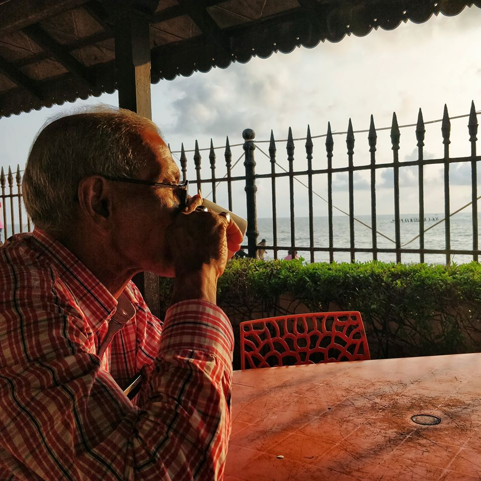

Date: 5th January 2020.

Place: Pondicherry, India.

It was morning time, 7:32 AM to be precise. 

I was with my father, we went on a walk along the beach to see the sunrise at 6:30 AM. On our way back we stopped at the Le Café, a famous cafe along the Rock beach in Pondicherry, to have some coffee. The previous evening, we already had quite nice South Indian coffee and this time we were pretty excited to try one along the beach.

To our surprise, one small cup of coffee costed 67 INR ~ 0.80 EUR. Why surprised? Well, it was a bit high priced in Indian terms or at least when compared to the previous evening when we had 4 for 80 INR ~ 1 EUR or 0.25 EUR/coffee!

I was happy the previous evening - having such a great coffee at a cheap price and I also was happy that morning - having a nice morning coffee at a "reasonable" EUR figure (coffee in Europe typically starts from 2 EUR or 3 EUR, so I chose "reasonable" in the context of India).

Many can guess from the previous two paragraphs what confusion I had to explain to my dad - me losing track of the currency. His reaction was "neutral" - maybe he was thinking about how he should explain to me some "financial" rules but anyway he didn't, instead with a brief silence we enjoyed first few sips of our coffee and of course the beach view.

Interestingly enough, a while later though, he started explaining to me on the coffee table that the lady at the counter was preparing the coffee from fresh coffee beans, manually crushed, and that exotism must have amounted to a high price (most places in India use instant coffee powder) . I replied, "Papa, I think it is a mix of what you said and it is a beachside so rates must be high".

Those 2 minutes of conversations were not related to finding the answers if we got charged high or low but they definitely served as a starter to dad-son "gratitude" talks on how that cup of coffee was worth having together near the beach irrespective how the world economy works.

---

---
